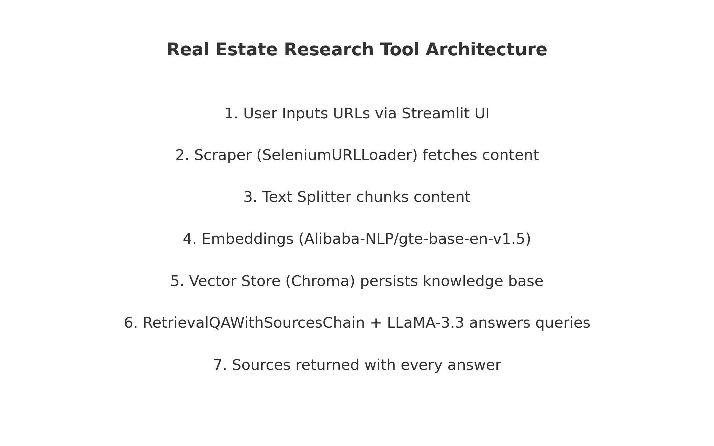

# 🏠 Real Estate Research Tool

A **persistent, URL-powered RAG app** that helps you research real estate trends, mortgage rates, and market news without copy-pasting articles into ChatGPT.

## 🚀 Why use this instead of ChatGPT?

### 1. No more copy–paste fatigue
Manually pasting long articles into ChatGPT is tedious. With this app, just paste the **URLs** — the app will scrape, chunk, embed, and index the content for you.

### 2. No context window limits
LLMs have finite context windows, meaning they can’t read and reason over dozens of articles at once.  
Here, content is stored in a **vector database**, letting the model search the most relevant chunks no matter how big your knowledge base grows.

### 3. Persistent, aggregate knowledge base
Instead of losing context every time you start a new conversation, this app **builds an ongoing vector store** from all the URLs you feed it — allowing cumulative research across multiple articles and days.

---

## ⚙️ How it works



1. **Input**: Paste 1–3 URLs in the sidebar (ideally real-estate related news).
2. **Processing**:  
   - Content scraped with `SeleniumURLLoader`.
   - Split into semantic chunks with `RecursiveCharacterTextSplitter`.
   - Embedded using `Alibaba-NLP/gte-base-en-v1.5`.
   - Stored in a persistent `Chroma` vector database.
3. **Query**: Ask a question about the aggregated articles.
4. **Retrieval & Answering**:  
   - Relevant chunks retrieved from the vector store.
   - Answer generated by `llama-3.3-70b-versatile` via Groq.
   - Uses `RetrievalQAWithSourcesChain` to always show sources.

---

## 🛠️ Tech Stack

- **LLM**: [`llama-3.3-70b-versatile`](https://groq.com/) (via `langchain_groq`)
- **Embeddings**: [`Alibaba-NLP/gte-base-en-v1.5`](https://huggingface.co/Alibaba-NLP/gte-base-en-v1.5) (via `langchain_huggingface`)
- **Vector Database**: [Chroma](https://www.trychroma.com/)
- **Framework**: [LangChain](https://www.langchain.com/)
- **Frontend**: [Streamlit](https://streamlit.io/)
- **Scraping**: `SeleniumURLLoader`

---

## 📦 Installation

```bash
git clone https://github.com/<your-username>/<your-repo>.git
cd <your-repo>
pip install -r requirements.txt
```

Make sure you have:
- **Python 3.10+**
- A `.streamlit/.secrets.toml` file with your Groq API key and Hugging Face token:
  ```env
  GROQ_API_KEY="YOUR_KEY_HERE"
  HF_TOKEN="YOUR_KEY_HERE"
  ```

---

## ▶️ Running locally

```bash
streamlit run main.py
```

1. Enter up to 3 URLs in the sidebar.
2. Click **Process URLs** to scrape & store.
3. Ask a question in the main input field.
4. Get a concise answer with sources.

---

## ☁️ Deploying to Streamlit Cloud

1. Push your repo to GitHub.
2. Go to [share.streamlit.io](https://share.streamlit.io/).
3. Connect your repo and deploy.
4. Add `GROQ_API_KEY` and `HF_TOKEN` in **Secrets**.

Your app will now be available online 24/7.

---

## 📷 Screenshot


---

## 📄 License
Apache License 2.0 – feel free to fork, modify, and use.
